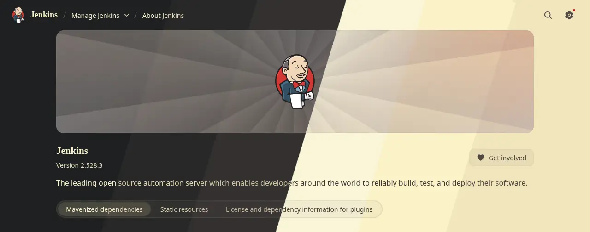

# Gruvbox Theme Plugin

This plugin provides the [Gruvbox theme](https://github.com/morhetz/gruvbox) for Jenkins.

After installing this plugin, go to _Manage Jenkins » Appearance » Themes_ and select one of the _Gruvbox Dark Hard, Dark Medium, Dark Soft, Light Hard, Light Medium, Light Soft_ themes.

Refer to our [contribution guidelines](https://github.com/jenkinsci/.github/blob/master/CONTRIBUTING.md).

Licensed under MIT, see [LICENSE](LICENSE.md).
